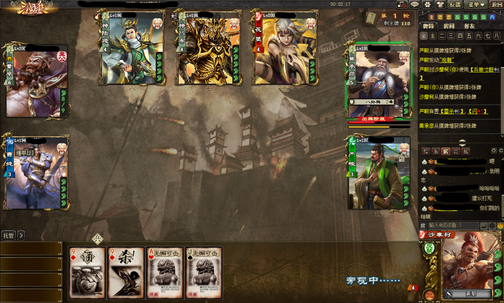
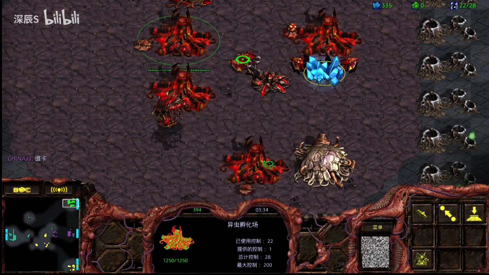
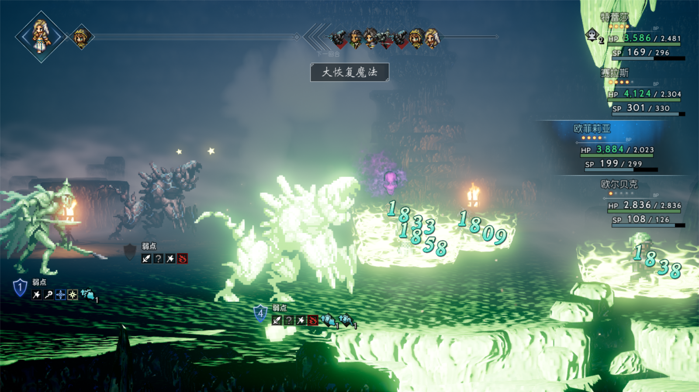
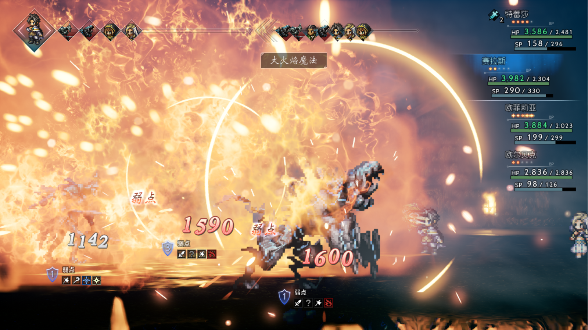
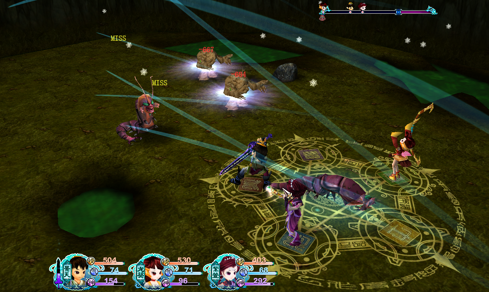

!!! success "类型：杂谈"
    **2021.10.27** 编写文稿

    **2021.10.29** 完成文章

# 星穹杂谈（1）回合制真的是落后的吗？

我是一位忠实的回合制游戏爱好者，说到**回合制**你们一定会想到**即时制或者挂机养成系统**吧。有很多人不看好回合制，这明明是已经被玩烂的老系统，**明明有这技术为什么不去做更加紧张刺激的即时制呢。**那么，回合制真的是落后的吗？

先说结论：回合制已经在很多游戏上获得成功，因此并不是回合制落后。**究其原因，主要是在于回合制的开发成本很低，再加上回合制的设计更考验战斗设计师的基本功**，导致部分厂商不思进取，尤其是回合制+挂机的组合，导致“回合制游戏”臭名昭著。一款设计优良的回合制游戏不失为一部佳作。

## 什么是回合制

回合制是一个老当益壮的游戏系统。90年代由于硬件和软件落后，绝大多数游戏采用了回合制系统。**回合制（战斗）主要围绕行动顺序和回合进行设计。**大部分情况下，回合制有着严格的行动顺序。
甚至，回合制的概念早在古代就深入人心，我们熟悉的跳棋、象棋、斗兽棋、三国杀、扑克哪一个不是围绕回合制设计的呢？

相比而言，**即时制也非常传统**，早在上世纪90年代，便有星际争霸系列著称的即时战略游戏（RTS)

## 传统的回合制

最传统的回合制基于回合/行动顺序，在这种框架下，同一时间只有1人行动，待当前单位行动结束后才会轮到下个单位行动。

回合制中讲究的是策略，行动顺序决定了战斗的效率，甚至成败。**在有限的回合内利用我方的增益，利用敌方的减益，甚至调整行动顺序，是传统回合制富有策略性的核心要素。**

在此以八方旅人（一方五十）为例，敌人身上具有弱点，使用对应的元素攻击可以击破一层弱点，当弱点全部被击破时，敌人在当前回合和下回合将会无法行动（陷入瘫痪），并且受到更高的伤害。

一个明显的结论是：**在回合的开始击破弱点，在敌方陷入瘫痪时进行爆发输出的收益是最高的。**这种此起彼伏的战斗被称为节奏感，可以提高回合制的策略性。

**回合制中的中流砥柱是数值系统**，如果敌我双方互相刮痧或者秒秒秒，那策略性就无从说起了。只有双方势均力敌，才容易发挥出回合制中的策略性。当策略性到达可以忽视的地步时，就演变成为数值游戏了。

## 半回合制和即时回合制

传统的回合制由于难以在玩法上突破，就逐渐舍弃严格按照行动顺序的概念。发展出半回合制和即时回合制。究其本质上，这是对传统回合制的一种突破，引入更多的变量和机制来提高游戏的策略性和可操作性。也是回合制当今的主流倾向。

仙剑奇侠传三引入了**非暂停行动**的概念，当单位行动时，并不会暂停其他单位的行动，因此会出现技能空放的现象。通过把控施法时间，提高技能命中率，从而提高游戏的策略性。

*非暂停行动：在单位释放动作/技能期间，时间条不会暂停。不是傻傻的等待动画播放完毕。*

莱莎的炼金工房的做法更加极端，在本作中，非主控角色在**到达行动条末端便会自动行动**，主控角色可以使用10AP来提前行动。并且引入了更多的游戏机智。

## 回合制是原罪吗？

回合制并不是一款游戏不好玩的原罪。**开发难度低，大部分厂商不用心的设计，胡乱堆砌数值与技能，才是回合制不好玩的根本原因。**回合制重策略、轻操作的特点让游戏很难给人强烈的刺激。如果说即时制是一道酸爽刺激的热菜，那回合制就是一道小甜点。

## 回合制的设计难点

回合制由于轻操作的特点，很难在动作上进行突破。考验的不是战斗设计师的战斗设计能力，而是系统设计能力。回合制的策略性才是回合制的设计难点。
而要做到高策略性，仅仅依靠堆砌技能、堆砌装备是不够的，相比于加法的设计，回合制更适合使用减法。**注重重复与组合提高游戏的策略性和可玩性**。

小新

最后向大家提个问题：你看好崩坏：星穹铁道的回合制吗？
