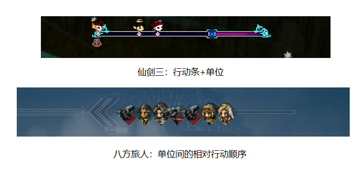
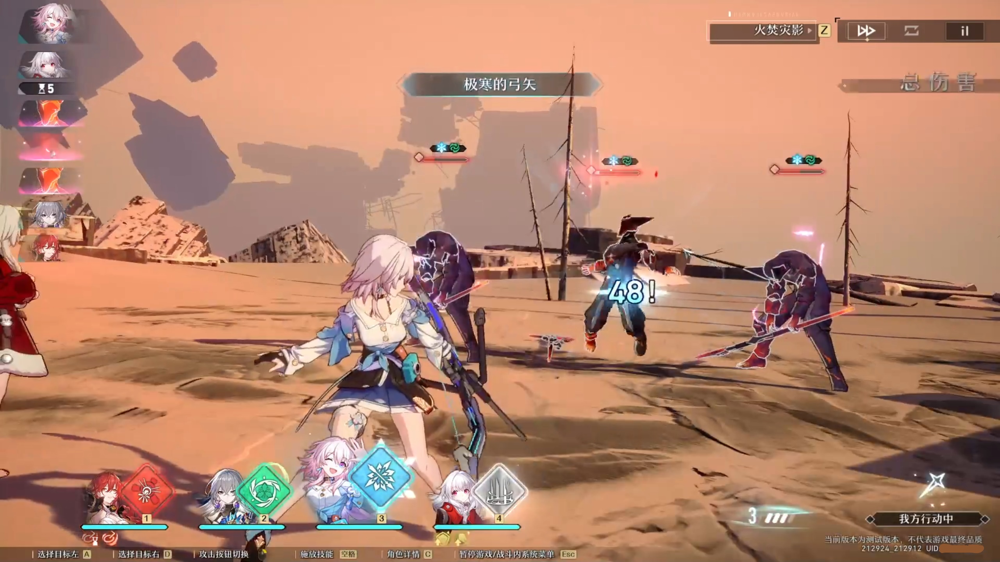
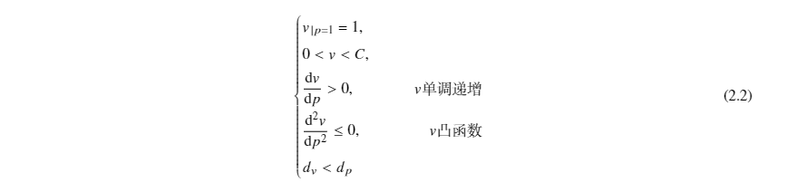
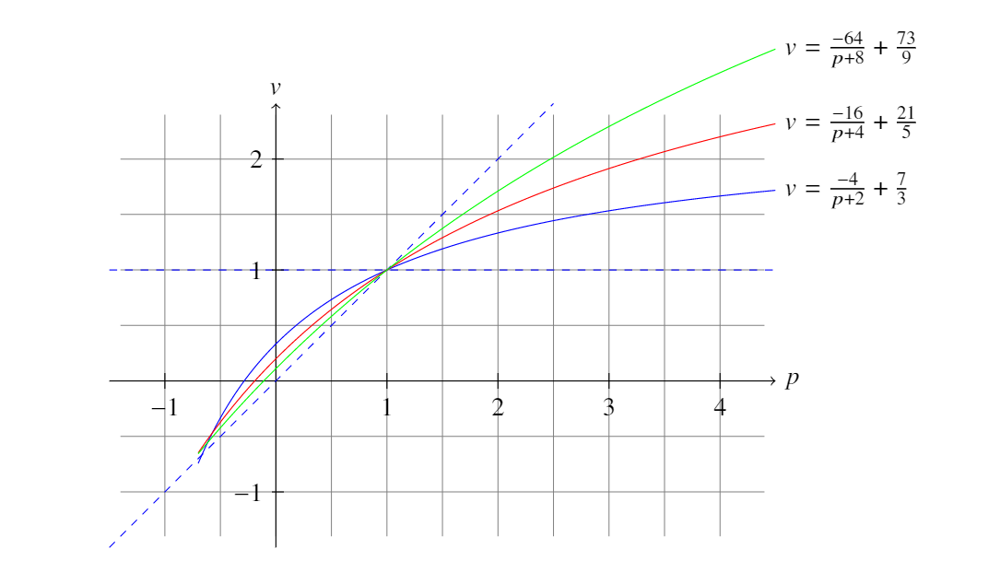
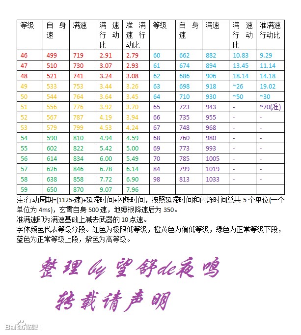
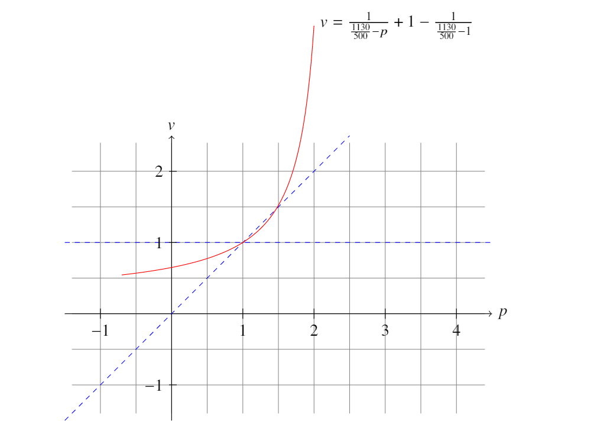

!!! success "类型：杂谈"
    **2021.10.30** 编写文案
    
    **2021.10.31** 完成文案

# 星穹杂谈（2）如何围绕崩坏：星穹铁道的行动条机制做文章？（优化建议）

崩坏：星穹铁道（之后简称星穹）的战斗系统类似于JRPG，有着传统回合制经典的**行动条系统**。很多游戏都是通过在行动条上做文章从而提高可玩性。

*行动条系统：游戏中，在屏幕的一侧会呈现(行动条+单位)或者(单位)顺序的面板，决定单位的行动顺序。*

与**行动条系统**关联最密切的是**速度**属性，速度越快，角色能够更快行动。当然，**角色的速度并不是越快越好，很多情况下，需要调整角色之间的位次关系。**

*速度：反映单位从行动条开始移动到末尾的快慢。行动速度和面板速度呈函数关系。*

*行动速度(v)：行动条长度与单位从行动条开始移动到末尾花费时间的比值。*

*面板速度(p)：显示在角色面板上可以由装备、等级等改变的数值。*

先说结论：星穹铁道的**行动条系统**略显平庸（仅一测），战技、终结技的发动**成本**偏低。大部分情况下是有战技、终结技就放，缺少策略性和游戏性。因此需要提高战技、终结技的发动**成本**，提高策略性。

## 行动的收益

**玩家在游玩游戏的过程中往往会使用收益更高的决策。**在星穹的一测中，普攻作为积攒战意值的手段，战技消耗1点战意值但更加强劲，终结技可以插入任何的角色行动。

经过简单分析，穿插使用普攻和战技，终结技有就放就是收益较高的方案了。终结技**收益高、成本低**的特点，降低了决策对于收益的影响，从而让终结技如何释放变得没有那么重要了，简单说，就是更加无脑了。

回合制有趣重要的一点在于**制定行动方案，从而完成看起来艰难的挑战，从而从其中获得成就感和满足感。相反的，仅仅依靠数值的堆砌来提高难度会降低人们的成就感或者新鲜感**，游戏游玩起来就没那么有趣了。

通过制定行动方案，从而闯过难关，是回合制的趣味之一，也是设计回合制游戏需要着重考量的因素。

## 行动条分类

行动条在表现上分为显示进度条+单位和仅显示单位之间的相对位置关系两种。

同时，按照一个单位是否可以跨轮次将行动条分为**轮次内行动条**和**自由行动条**两类。

*轮次内行动条：单位按照一定的规则在一个轮次内有且仅行动一次。*

*自由行动条：行动顺序不再依赖轮次，在一定轮次内，不同单位的行动次数不一定相同。*

其实也非常好理解，轮次内行动条相当于10次跑100m，每次从起点开始跑。而自由行动条相当于一口气跑1km。

目前星穹的行动条属于**自由行动条**一类。可以从以下几处信息中进行佐证。

[引用文章](星穹铁道一测人物技能记录)

*事实一：存在技能描述为“我方全体行动条提前25%，同时...”（艾丝妲终结技星空祝福）；“释放普通攻击后，布洛妮娅的下一次行动提前15%”（布洛妮娅被动先人一步）；“清除我方一个单体目标的负面状态，并使其行动提前100%，...”（布洛妮娅战技作战再部署）。*

*事实二：存在技能描述为“使受到攻击的目标行动推后5%”（桑博战技反复横跳的爱）；“使受到攻击的地方目标陷入禁锢状态，行动推后30%”,...”（瓦尔特终结技拟似黑洞）。等*

*事实三：存在技能描述为“同时目标行动后，速度提高25，持续一回合。”（布洛妮娅战技作战再部署）。*

*事实四：存在技能描述为“有100%基础概率使得受到攻击的敌方目标速度降低20，持续2回合”（丹恒战技云骑枪术·疾雨）；“攻击命中时有50%的基础概率使受到攻击的敌方目标速度降低20。”（瓦尔特战技虚空断界）。*

*事实五：有小概率在一个轮次内一个单位行动两次。*

## 行动速度和面板速度的函数关系

行动速度等价于行动频率。例如，对于行动速度分别为1和1.2的两个单位A和B，当A行动1次时，B行动1.2次。面板速度则是角色中的一个属性值。

在星穹中，角色的基础速度在100±10波动，速度的增益和减益为固定值，一般在20~30左右。

为了构建行动速度和面板速度的**函数关系**，我们引入以下假设：

1. 行动速度限制在一个常数域内（当面板速度在一个合理区间，最好可以推广到正实数域）。

2. 存在**稀释效应**，即增益叠的越多，单位增益产生的收益越低。

3. 行动速度的增长慢于面板速度的增长。（即面板速度2倍，行动速度小于2倍。）

其中第2、3条的限制主要是为了**约束速度增益或者减益所能带来的影响，提高系统的稳定性**。

我们引入以下符号：

可以得出：

我们发现反比例函数恰好符合以上特征，因此我们选取该函数作为行动速度和面板速度的函数关系。

由于篇幅和数据量不足，我仅仅给出了符合条件的函数，至于星穹是否采用了该函数，就不得而知了。

## 行动条设计的失误例子（永动机）

在行动条上设计失误的经典例子为仙剑奇侠传四中的光速韩菱纱。当基础速度达到937时可以进入光速状态。（光速指永动机，指无限次行动。）

仙剑奇侠传四中有一个仙术仙风云体，其效果是速度增加20%。937的速度经过仙风云体增益后，速度变为1124.4。虽然这数值挺平常的，但是仔细看行动周期就会发现问题。

以500为参考速度值，做出函数图。一看函数，让我怀疑制作组是不是把函数关系写反了，**无穷大的可能性便是光速产生的本质**。

资料来源于百度贴吧：[仙剑四菱纱的速度怎么弄这么快?](https://tieba.baidu.com/p/2354552746)

## 控制行动顺序的意义

星穹一测的最高层**裂界深渊**中，一般杰帕德和布洛妮娅是必带的，前者是为了加盾，后者可以提前行动+加速。

由此可见，**和行动条产生关联的角色极有可能是未来星穹公测之后的人权卡**。多一次行动带来的收益一般大于多一个增益的收益。在目前公布的角色中布洛妮娅、艾丝妲、瓦尔特、桑博有提前行动、加速、推迟行动或者减速的机制。

另外一方面，辅助角色的速度应当比输出角色稍高，这样输出角色可以更加充分利用各种增益。

公测后星穹的装备中是否存在速度词条，我持一个保留态度，我希望能够加上速度词条。

[引用文章](全技能演示)

[引用文章](全光锥数据)

[引用文章](技能记录)

## 星穹的行动条优化建议

在文章的开头我指出战技、终结技的发动**成本**偏低的特点。在我的构想中，可以做以下的修改。

1. 普攻后的1次行动减少为0.8回合。可以恢复1点战意值。

2. 终结技可以随时插入并且释放修改为终结技可以随时插入，释放后的1次行动增加为1.4回合。（提高释放成本）

3. 目前战技需要消耗1点战意值，修改后为战技可以强化两次，每强化1次多消耗1点战意值，强化后的战技需要延迟0.2回合*强化次数（咏唱时间）行动。在咏唱时间内，受到2次伤害后恢复消耗的战意值，并且需要0.6回合后才可再次行动。强化后的战技可以造成更高的伤害或者更强的效果，或者改变战技的形态。（增加爆发）

4. 战意值的上限可以增加，例如增加为6个。

5. 加入防御动作，防御后的一次行动减少为0.6回合，且受到的伤害为原来的60%。增加一定的效果抗性。

这些建议中的数字仅仅为一个示例，**其核心在于提高战技、终结技的释放成本的同时提高收益。从而提高游戏的可玩性。**

小新

最后向大家提个问题：你觉得星穹铁道要怎么做才能更好玩呢？

