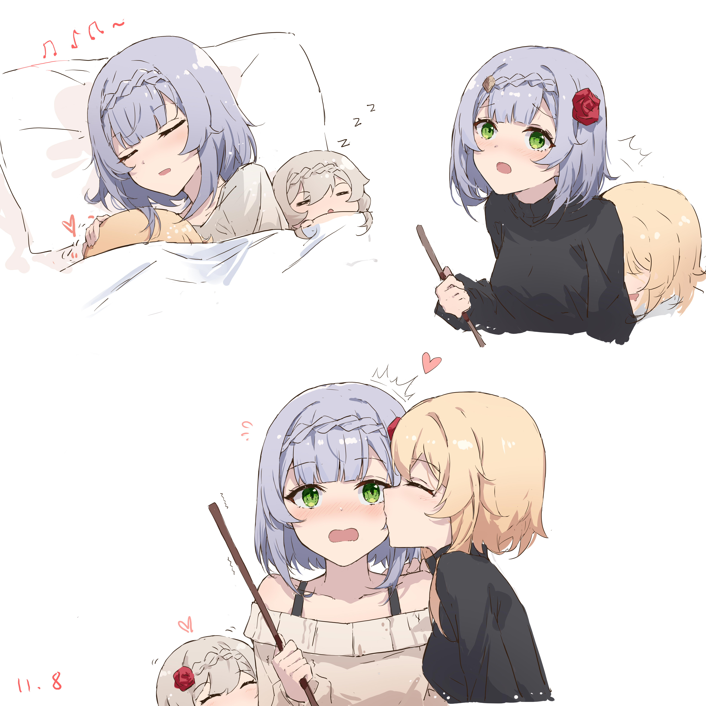
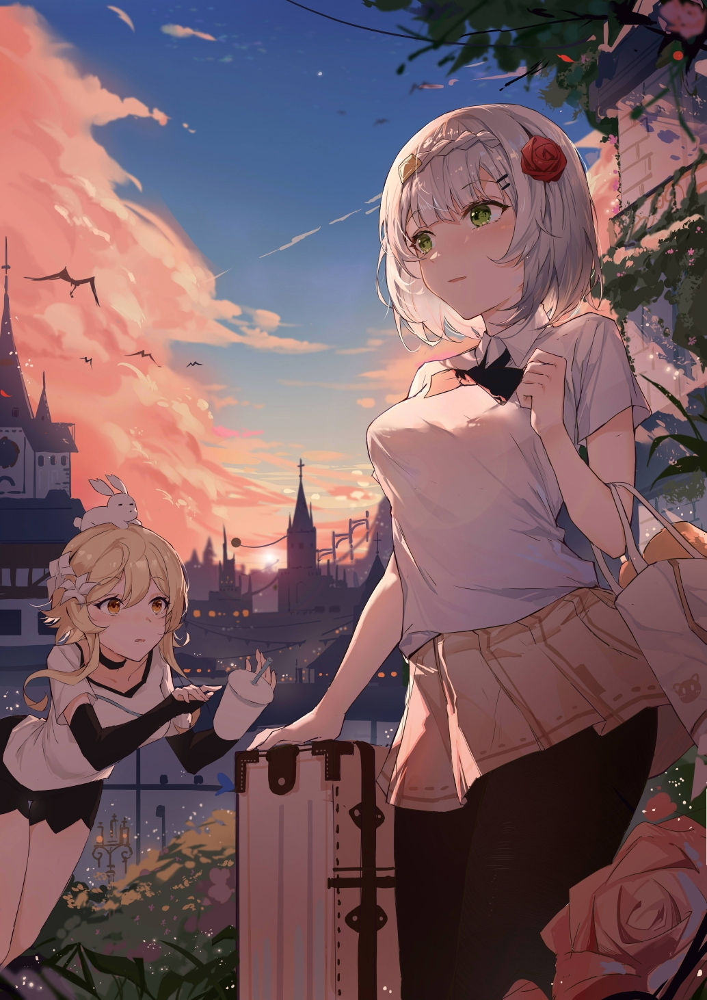

!!! note "类型：杂谈"
    **2021.11.1** ?/default

# 星穹杂谈（3）买断的盈利方式有未来吗？/1-3

## 大纲

全文大约6000~8000字，总共拆分为3篇文章。写完文章大约需要4-5小时。主要使用小论文的方式来写。

第一篇文章主要讲各种付费方式的概念以及区别。

第二篇文章主要讲本体免费+DLC收费所带来的问题。

第三篇文章主要讲买断制游戏发展所带来的挑战和未来。

## 第一篇

崩坏：星穹铁道仅仅在一测已经有了一个完整的游戏模型，**对于一款游戏来说开发进度往往和游戏体验不成正比**。假如说100%的开发进度对应100%的游戏体验的话，90%的开发进度往往只能给人70%甚至更低的游玩体验。

游戏给人沉浸的体验往往在于细节的发挥，细节并不能孤立的发挥作用，它必须衬托与主体之上。这也决定了，**游戏是一门复杂的艺术**。

对于游戏公司来说，如何给人良好的第一印象，如何**规避风险**，是一个非常重要的问题。

因此，如何**最大化商业利益**，成为了游戏公司永恒的话题。无论是买断、点卡、本体免费+DLC付费、EA版本等，都是不同的游戏厂商通过实践逐渐成熟的盈利方式。它们要解答的问题无非是**投资回收期**以及**消费群体的统计特征**两类。

*投资回收期：一个经济学中的概念，指从投资开始到实现正收益所需的时间。如果没有盈利，则记为无限长。*

*消费群体的统计特征：具有相同/相似消费习惯的人群体现出来在大样本量下的特征。*

*DLC：Downloadable Content，现在一般指扩展包或者额外内容。*

*EA：Early Acess，一般指游戏在正式发售前售卖的抢鲜体验版本，公司一般以相对低廉的价格出售来实现提前的资金回收。*

先说结论：买断制几乎是几种盈利方式中最具风险的类别，也是最容易给人良好印象的类别。买断制游戏的未来在于人们对游戏消费这一行为的普遍接受和理解。以及游戏是商品这一概念的普遍认知。

## 付费方式是什么

付费方式（特指游戏的付费方式）为**游戏公司**为实现盈利而采取的手段。按周期一般分为**概念宣传、首发宣传、正式发售、售后服务、后续内容跟进几个阶段。**游戏中资金的投入也不仅仅会用于开发，还会用于广告与媒体宣传、公关、市场分析等方面。

在后面的分析中，付费方式主要指如何售卖游戏，主要以买断、点卡、本体付费+DLC收费为主要的代表。它们之间的区别主要在于**投资回收期**，以及**面向的消费群体**的统计特征。

*买断一般指游戏发售时的一次性付费，对于部分游戏平台，会有2小时内无条件退款这一政策。也有售卖激活码激活游戏的方式，不过现在已经越来越少采用这一方式了。有时候，也会采取抢先体验的方式进行售卖。*

*点卡一般按游戏时常收费，云游戏这一方式也借鉴了这种方式。*

*本体免费+DLC收费一般指游戏的本体主要内容是免费的，而额外的增值内容（例如皮肤、角色、装备）等是收费的。*

游戏**氪金**这一概念从诞生起就饱受人群的非议，而且对于部分人群造成了很大的经济压力和困扰。**氪金**作为**本体免费+DLC收费**的标签确实从很大程度上概括了氪金游戏的特征，然而这种观念既是不准确也是不全面的。

例如原神这款游戏就是典型的**本体免费+DLC收费**的付费方式。

**本体免费+DLC收费**已经逐渐成为了未来的趋势。一方面，本体免费其天然的“免费”特征让玩家的游玩门槛变得很低，玩家仅需一款较好的游戏设备以及网络便可以游玩这款游戏；另一方面这降低了玩家的试错成本，玩家不需要付费便可以知道游戏是否好玩。

同时，**本体免费+DLC收费**也将消费群体分开。一般的游戏玩家可以免费体验游戏的大部分内容；有追求的玩家也可以为这款游戏付费从而获得更好的游戏体验；部分玩家甚至可以使用付费这一方式进行流量变现。

然而，这并不意味着**买断制**游戏是没有未来的，直至今日，绝大多数的佳作仍然采用**买断制**的付费方式。同时，**本体免费+DLC收费**的方式也存在问题。

## 游戏的有效时间

游戏最终还是要通过“别样的感受”来留住玩家的。原神这款游戏虽然有每日任务和活动来提供游戏时间，但这些时间是无效的。一款经典的剧情向游戏往往仅有**10~100小时的有效时间**，而延长有效时间的要素往往只有**随机化和创造**。因此，在一款游戏在几十小时后变得乏味，这是必然的，因为游戏的内容只能承载这么多。

有了有效时间的概念，我们便可以在一定程度上衡量游戏的价值了。我们以原神这款游戏的1.0~2.0版本为例，假设有效的游戏时间为100小时，并且每个月冲个月卡，那么其**单位有效时间的价值**大约为3元/时。不妨以这个标准来衡量一下你玩这个游戏是否值得吧。

**买断制**与**本体免费+DLC收费**的付费方式的区别在于：前者游戏的有效时间是一次性提供的，而后者是分段的方式来提供，甚至能否完结都无法确定；另外，买断制游戏在不同人群中的**单位有效时间的价值**是相似的，而后者则有明显区别，可以说白嫖用户是借用付费用户来进行消费。

根据二八法则，在**本体免费+DLC收费**的游戏中，20%的玩家贡献了80%左右的氪金量。一般来说，采用这种付费方式，可以提高人群平均的**单位有效时间的价值**，因此这也是这种付费方式更赚钱的原因。

## 投资回收期

一款游戏需要投入资金，然后作为商品出售，因此其必然有投资回收期。**买断制**游戏的投资回收期一般大于**本体免费+DLC收费**游戏。对于相同的内容，买断制游戏必须一次投资完毕，然后才能回收资金。而买断制虽然仍然有较大部分的资金需要在起步阶段投资，然后后续内容的追加可以分段投资，其资金回收也是分段的。

因此，**买断制**游戏相对风险更高。当然，其有个明显的有点就是维持日常运行的成本很低，一般仅需要修复BUG和开发后续内容即可。

对于玩家来说，**买断制**游戏也必须在一开始买下（有时可以试玩），游戏所带来的收益是随着时间递增的。玩家所需要面临的风险是这款游戏是否值得一玩以及能够玩多久。而**本体免费+DLC收费**的游戏以极低的门槛游玩，然后视自己的情况进行付费。

当然，**本体免费+DLC收费**对于厂商和玩家来说，都需要花费“日常的时间”。对于公司来说是维持游戏后台服务的运行；而对于玩家来说，则是通过日常来保持游戏的进度。

本篇文章所引用的诺艾尔图片均来自于画师鸦居丶大大。

小新

## 第二篇

## 长期游戏存在的问题

## 抽卡的盛行

## PvP、PvE与PvC相关概念

## 第三篇

## 21世纪初严重的游戏盗版问题

## 电子dp的观念

## 买断游戏的未来
