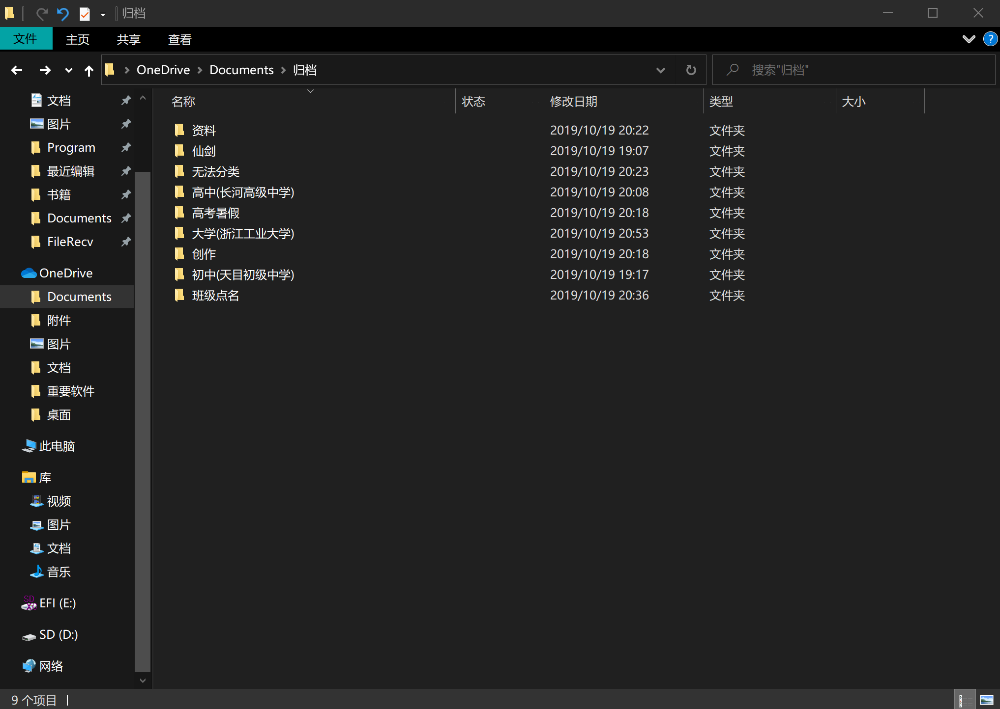
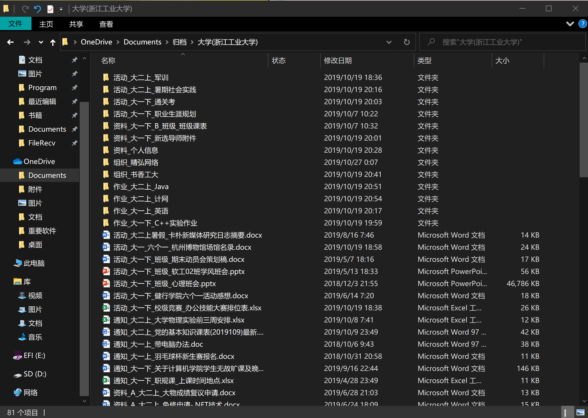
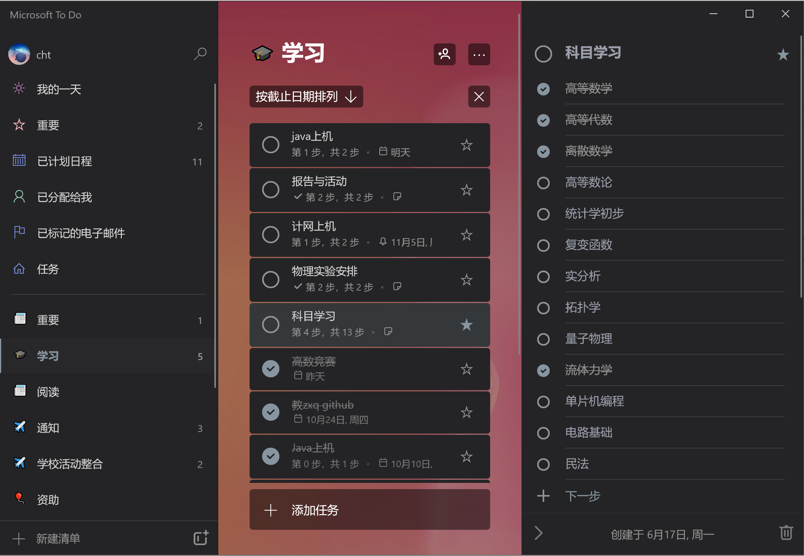
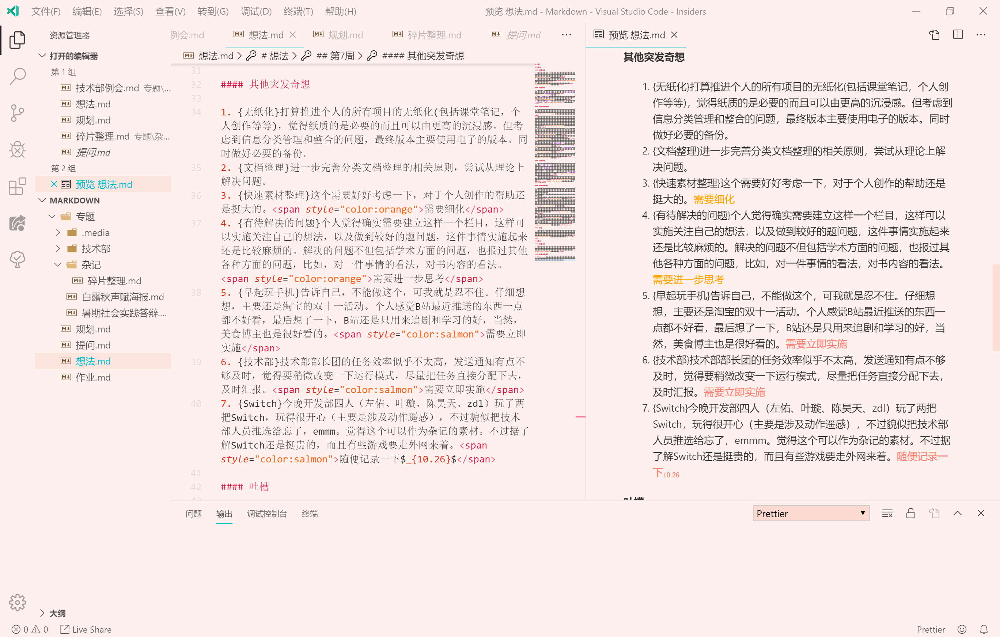

!!! success "类型：随笔 已停止更新"
    本文已同步在[微信公众号]()上发布
    
    **2019.10.27** 完成文章

# 碎片整理

## 构思

这篇文章构思了差不多有5天左右了，一开始打算是写**如何整理通知**的，然后就咕咕咕了。还有一个原因是自己的记忆力真的很差，而且特别不喜欢打开QQ群找通知。之前一直因为记不住事情而烦恼，别人QQ找我我有时会搁置到完全忘记。最近一直在想如何**碎片整理**，也就是如何将生活中琐碎的事情整合到一起，这样看起来就舒服多了。

## 碎碎念

从初中开始我就有写日记的习惯，那个时候很闲，差不多一周能写出好几篇。初中的日记我还放在书柜里，可是年代久远，我已经不愿去翻阅之前写的日记了。大学就不太一样，想写一篇文章就得找一个相对空闲的时间，于是便改为写杂记了，不过我有点懒，也很难写完一个专辑。

大学和高中比终归有许多不同的地方，起初认为大学闲，但后来就不这么认为了，大学虽然更自由，但可能也更加容易让人迷茫，让人焦虑。我在大学期间让我烦恼的事情大概是**赶不完的部门任务、看不完的通知、复习不完的科目**。为了理清事情的先后顺序，重要性我也是下了很大的功夫。起初我是打算用一本**日程集**的本子来整理的，但是呢，感觉找本子就特别麻烦，做了很长时间也没有效果。大概是我字写得不好看，而且不好分类整理归档。

后来找到了新的方法，最近用起来还是挺舒服的，获得了初步的效果，这也是我写这篇文章的原因。可能每个人适合的方法都不太一样，但你们看完我写的，应该还是能获得一点知识的。

## 一点点经验

我的思维总是在不断地跳跃，也时常会有一些奇思妙想闪过我的大脑，但我总是不能记住。对于通知来说，分散在各处便显得杂乱无章，也常常出现被刷屏的尴尬。对于此，有些人选择每天将事情记在便签上，也有人会拿本本子记录。但是我们会忽略最重要的事情，这样整理也只是将项目**堆叠**在一起，项目之间的差异性并没有得到很好的展现。这里便是我要说的**分层级整理技巧**。

我首先将我们接受和制造的信息抽象为**项**，并将其种类、使用时间等抽象为**属性**，再加上信息的承载介质**媒体**，就构成了信息的主要内容。我们需要做到的是，合理的组织**项**的层级和顺序，便于我们去查找和阅读。

### 整理计算机文件

第一个容易受到关注的便是我们的文件了。你是否会看到这样的状况，桌面上全是文件和文件夹，每当我们打算寻找一个以前打开文件的时候，你便显得无措了，我可不知道当时我的文件是怎么命名的，被放在了哪个地方。我有一个习惯，我会尽量全面的收集能收集到的所有信息，并将其归档。你们可能不需要做到像我这样，但是学点整理文件的技巧，还是挺不错的。

我们需要建立一个观念，就是有规律的放置物品会让我们更加容易找到东西。对于计算机的文件来说也是同样一个道理。我们需要关注的是**计算机的索引和排序**机制。先放一张我整理的效果图。

对于文件来说，它与某一个主题是有密切联系的，同时，它也需要反应它的时间特征。我之间的做法是**单纯的分类**，弊端主要是没有反应时间特征以及没有对文件名做一定的处理，导致查找效率低下。现在我使用的是**时间主题混合分类**。其实所有分类方法的目的也只有一个，就是能够较好的**提要和分层**。

我先简要说说自己这样设计的理念。第一，大时间分类是最主要的特征，这也是我归档顶层大多数是按照时间分层的一个原因。第二，类别也是突出非常重要的特征，我大概将信息整理成活动、资料、作业、通知等四个板块。第三，每个分类的信息侧重点也是不一样的，需要有差别的进行设计，原则就是尽量把重要的信息放在前面。当然，最重要的需要一个统一的文件命名约束。

### 整理通知和各种事项

整理通知，我并不推荐使用本子来记录（如果是习惯使用本子来记录和喜欢做手账的另说），本子记录不容易查找，不容易记住需要长期关注的事项。在这里，我推荐使用`Microsoft To-do`软件，作为`To-do`重度使用者，我非常喜欢它精简的外观和比较完善的功能。

PS: 说到科目学习就感到惭愧

最让我感觉方便的两个功能是提醒、备注和附加文件功能。比较无力的功能是重复。它让我可以做到快速收纳QQ群里发的通知，然后将他放到`To-do`，免却看QQ群的烦恼，多好。要让这个软件发挥应有的作用，我想最重要的是请动手及时记录事情，不然这个软件就会成为摆设。

### 整理思维

我之前也说过，我的思维是不断跳跃的，我经常会突发奇思妙想，但是我很快就忘了。整理自己的思维，及时记录自己的想法，时常反思，对于自己的成长还是很有帮助的。整理思维相比前两项，需要更多的练习和摸索。

我以前是使用杂记来记录的，但是其很难用于之后的回顾和提高，所以，我们需要对此做一定的**分类处理**。为了更加有效的整理，我们可能需要准备一些可以记笔记的软件：例如OneNote，网易云笔记。但我的习惯很特殊，我习惯使用**Markdown**来记录（做整理的话不推荐使用Word，应为其无法体现文档目录结构）。但是这并不影响我的分享。但最关键的还是勤于记录和观察。

我大概把我要记得事情分为几类：规划、提问、想法、作业、专题。

规划大概是记录一天内应该要做的事情，当然，这个只是一个清单，目前所有规划的内容都不是强制性的，只是起一个指导作用而已。（每天把要做的事情记在脑子里对我来说是很大的负担）

提问大概是想记录自己在日常生活中遇到的问题，目前这个部分还没有明确的规划。我知道自己不喜欢找别人解决问题，我觉得自己在这个方面有待提高。

想法部分应该是我比较侧重的地方，应为我想要持续写作和提高，及时记录自己的想法（随便写写）也是非常有意义和有趣的，这样也可以认识不一样的自己，有时候想得太多了大脑就会被想法给围住。

专题就是用来专门用来写文章和记录例会和活动的，到时候可以成为一种素材。

这些内容只是一个参考，最重要的还是需要不断地去记录，去记录有意义的事情，让自己伤心的事情，让自己印象深刻的事情，还有自己的感想。

PS: 欢迎大家疯狂吐槽我记的东西

上面这张图是我用来整理的地方，软件使用的*Visual Studio Code*，使用*Markdown*语言来书写文字，主题用的是*Horizon Theme*(淡淡的粉色看起来挺舒服的)。*Markdown*的话使用门槛还是有点高的，请慎重选择。

## 结尾

只是随便分享一下自己的想法，大家随便吐槽。下期打算写如何整理课程笔记和合理使用标记的好处，不过很容易咕咕咕。

## 其他资料

!!! info "Draft"
    这只是一个草稿，编辑于2019/10/27

你是否打开电脑，就看到桌面七零八碎的各种文档，他们毫无条理，错综复杂？学会正确的整理文档(文件)可以提高电脑使用的舒适度。虽然说现在出现的笔记类软件和照片类软件都已经帮你做了大部分工作。但在更多情况下，单独形式的文件依旧存在。

### 定义角色

一个文档可能有很多种角色，有可能是上面发下来的通知，也可能是自己准备赶工的实验报告，也许是你自己写的一些文章，当然，你也许觉得按照**文件的用途**进行分类是一种很好的方法。可是你是否想过，文档的类型不仅是依照场景和角色变化的，还有文档的有效期。

### 定义文档的有效期

按照文件的用途进行分类只是一个方面，设想你收到了一个通知，你非常利索的把它放到了`通知`文件夹。可是，你最近还能记得文档在哪儿吗？个人认为越新的文档，其创建时间和修改时间的优先级在寻找文档时就越高。

### 我的习惯

需要归档的文档：

类型_时间节点_项目/活动_用途

资源_(资源主体)_资源介绍

创作_时间节点_主题_

通知_时间节点_项目/活动_用途

活动_时间节点_活动主题_活动名称

组织_组织名_时间节点_主题名

#### 资料

资料_资料类型限定_时间节点_资料适用主体_资料类型

##### 资料类型限定

A 属于自己的个人资料
B 关键性资料，不能够公开
C 介于B和D之间
D 公开性资料，可以公开

##### 特殊类型的资料

例如学科资料，可以部分不按照此规范来，但是也需要一定的命名规范。

作业_时间节点_课程名_课程类型声明

尽量在外部看去一个文档组织起来是有序的，按照类型开头是为了更好的进行筛选和排序操作。如果一个活动在时间上有很高的连续性，可以使用文件夹去代替文件，但不推荐这么做。

#### 资料命名方式

### 如何归档

首先应该考虑到一个文档的时间跨越度问题，有些文档只在高中有用途，而有些文档只在大学有用途。。
